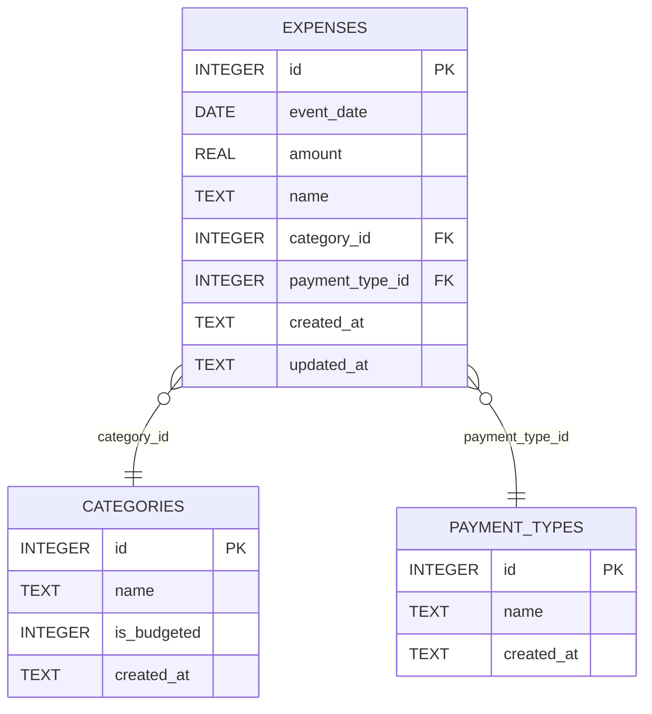

```mermaid
erDiagram
    PAYMENT_TYPES {
        INTEGER id PK
        TEXT name
        TEXT created_at
    }
    CATEGORIES {
        INTEGER id PK
        TEXT name
        INTEGER is_budgeted
        TEXT created_at
    }
    EXPENSES {
        INTEGER id PK
        DATE event_date
        REAL amount
        TEXT name
        INTEGER category_id FK
        INTEGER payment_type_id FK
        TEXT created_at
        TEXT updated_at
    }

    EXPENSES }o--|| CATEGORIES : "category_id"
    EXPENSES }o--|| PAYMENT_TYPES : "payment_type_id"
```